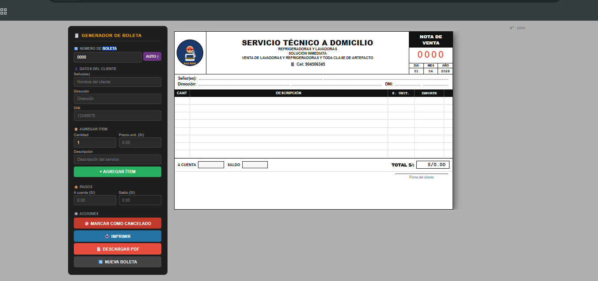

🧾 Generador de Boletas de Venta

Aplicación web para crear boletas de venta de forma rápida, visual y profesional. Permite agregar clientes, ítems, calcular totales automáticamente y exportar a PDF o imprimir.

🚀 Características
📄 Generación de boletas en tiempo real
👤 Registro de datos del cliente (nombre, dirección, DNI)
📦 Agregado dinámico de productos/servicios
💰 Cálculo automático de total, saldo y pagos
🖨️ Opción de impresión directa
📥 Exportación a PDF
🔢 Numeración automática de boletas
🚫 Marcado de boleta como CANCELADO
📱 Diseño responsive
📸 Vista previa

🛠️ Tecnologías utilizadas
HTML5
CSS3
JavaScript
html2canvas
jsPDF
📂 Estructura del proyecto
boleta-app/
│
├── index.html
└── README.md
⚙️ Instalación y uso
Clona el repositorio:
git clone https://github.com/alexis20010211/generador-de-boletas.git
Abre la carpeta del proyecto:
cd generador-de-boletas
Abre el archivo index.html en tu navegador.
📌 Cómo usar
Ingresa los datos del cliente
Agrega productos o servicios
Visualiza el total automáticamente
Imprime o descarga la boleta en PDF
🔥 Funcionalidades futuras (ideas)
Guardado de boletas en base de datos
Generación de reportes
Sistema de usuarios
Integración con SUNAT (Perú)
Diseño tipo factura electrónica
🤝 Contribuciones

Las contribuciones son bienvenidas. Puedes hacer un fork del proyecto y enviar un pull request.

📄 Licencia

Este proyecto es de uso libre para fines educativos y comerciales.

👨‍💻 Autor

Desarrollado por Alexis
GitHub: https://github.com/alexis20010211